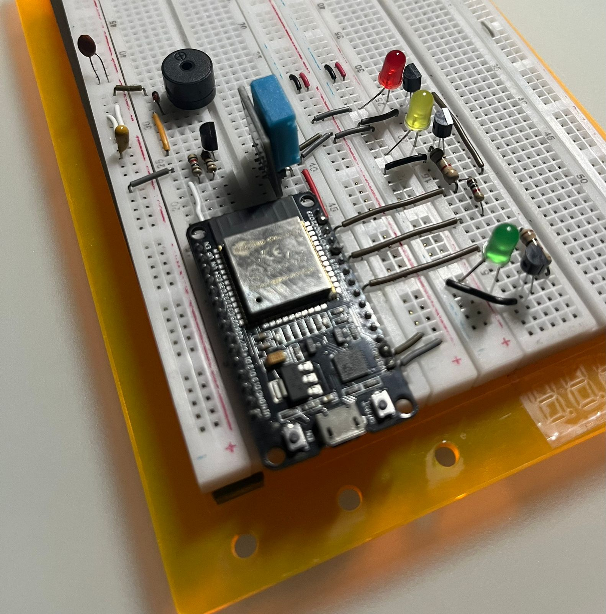
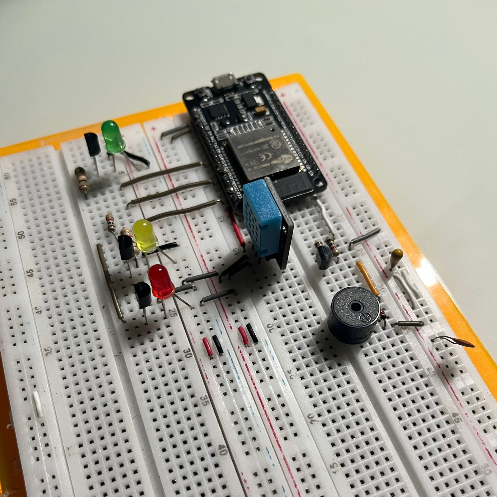
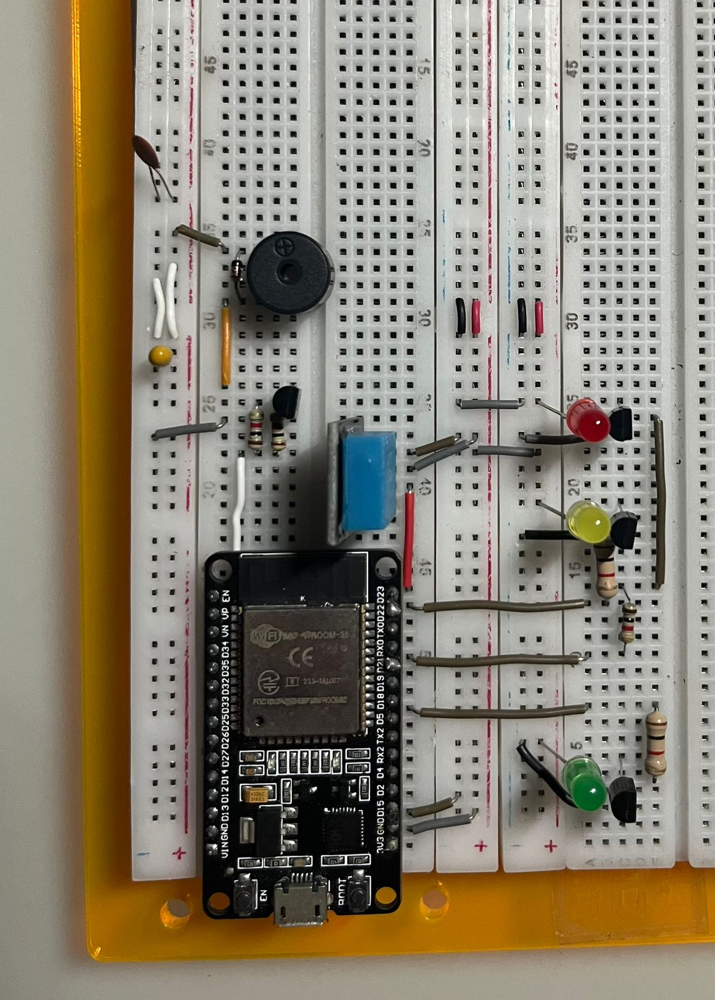

# Cliente MQTT para telemetría de temperatura y humedad con alarmas indicadoras
Este repositorio contiene la solución del Proyecto 3 del curso Taller de Sistemas Embebidos. Los autores de este trabajo son Nagel Mejía Segura, Wilberth Gutiérrez Monter y Óscar González Cambronero

##  Desarrolladores
El sistema fue desarrollado por:

- Nagel Eduardo Mejía Segura
- Oscar Mario Gonzalez Cambronero
- Wilberth Daniel Gutierrez Montero

## Construcción Física
Para la construcción física se utilizó una placa alrededor del *ESP32* genérica, conectándola a una placa de prototipado de doble riel, por la cual se conectan pines por medio de un transistor BJT tipo NPN de lado bajo a tres diodos LEDs de colores verde, amarillo y rojo, así como al sensor de temperatura y humedad DHT11 ,y un zumbador pasivo como indicador auditivo.

## Dependencias
El proyecto fue desarrollado utilizando *ESP Integrated Development Framework* con versión mínima 5.5.0, por lo que este requiere de varios de los componentes presentes en dicho ambiente, además requiere de su integración con *Cmake* para realizar la construcción del proyecto y la programación de la placa *ESP32*.

Como corredor *MQTT* se utilizó el servicio de alojamiento de *thingsboard.cloud*, por lo que se requiere registrar una cuenta y añadir una serie de dispositivos para iniciar la comunicación.

## Funcionamiento y Ejecución
Un vez programado el *ESP32*, este se encarga de establecer la conexión con el corredor *MQTT*, la arbitración se realiza por medio de solicitudes *Remote Procedure Call*, que con una serie de manejadores en el *ESP32*, permiten las ejecución de las rutinas correspondientes al modo manual y automático del sistema, este último permitiendo establecer umbrales para la indicación de valores de humedad con los LEDs y temperatura en el zumbador.